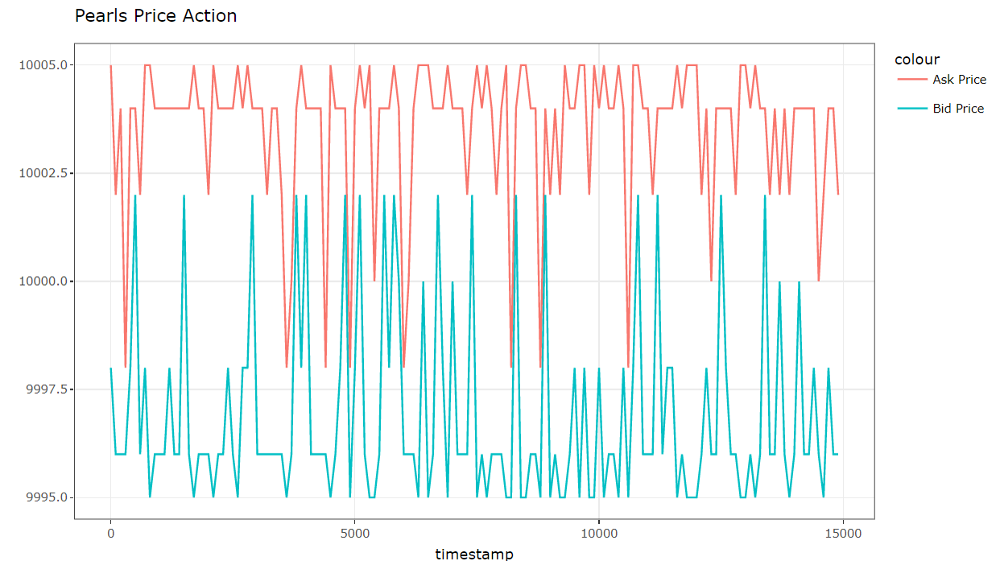
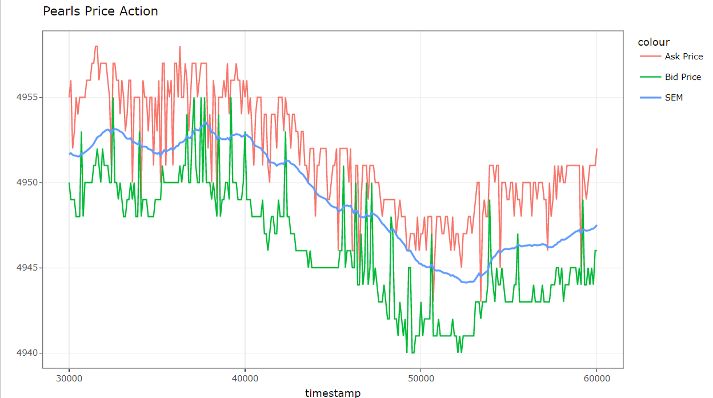

# IMC's Prosperity Trading Challenge

Welcome to the official GitHub repository of team Shiro!

*Highest rank: 45th of 7007 teams*

Prosperity is a 10-day global trading challenge, consisting of 5 rounds, hosted by IMC Trading. For each round, a new product is released with its own characteristics and price action that guide profitable strategies. Teams are challenged to combine Python skills, strategic insight, and analytics to trade on a virtual market and bring their island to prosperity.

We, a team of three penultimate students, managed to reach our final rank of 79th among 7007 global teams. We would love to present our strategies and analysis across this challenging competition.

### Team member:
- Dat Su depzai
- Long bu c thang duoi
- Moe bi thang tren bu

 

## Round 1

Pearls and Bananas are two products introduced in the first round and we work on them separately.

For Pearls, it always stays in a range of [9995, 10000] and has a stable mean of 10000. There are times when the best bid is 10002 or the best ask is 9998. Therefore we market-take any ask below 10000, and accept any bid above 10000.

  
    
  

For Bananas, the bid and ask price always have a consistent gap and some spikes occur occasionally. We use a method that tracks a simple exponential smoothing (unlike a moving average, the weights attached to the observations decrease exponentially as we go back in time) and cut through the spikes. Whenever it cut a spike, we enter a trade.

Midpoint is defined by:
$$mid_t = \frac{bestask_t + bestbid_t}{2}$$

Simple Exponential Smoothing Equation:
$$l_t = a*mid_t + (1-a)*l_{t-1},$$

 where $a = 0.08$, $l_0 = 4950$ 

The rate at which the weights decrease is controlled by the parameter $a$, which is chosen by running simulated tests to maximise profit. We market-take orders with prices that pass through the SEM line plus an additional range (avoid some spikes that barely pass).

  
    
  

 

## Round 2

 

## Round 3

 

## Round 4

 

## Round 5

 

