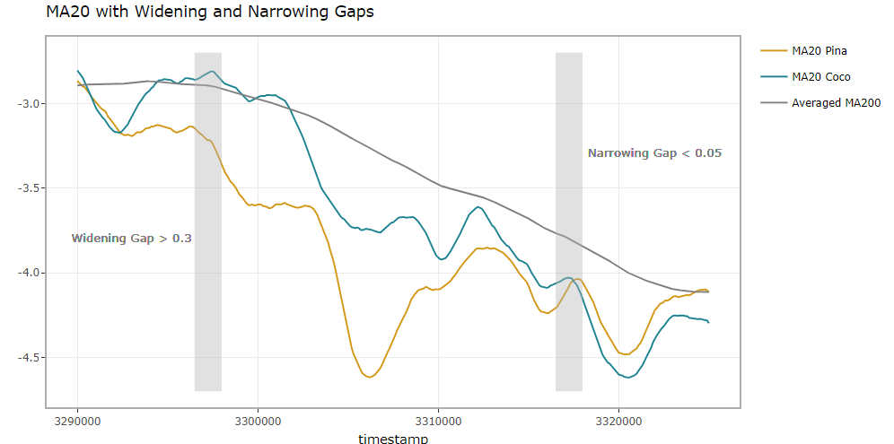
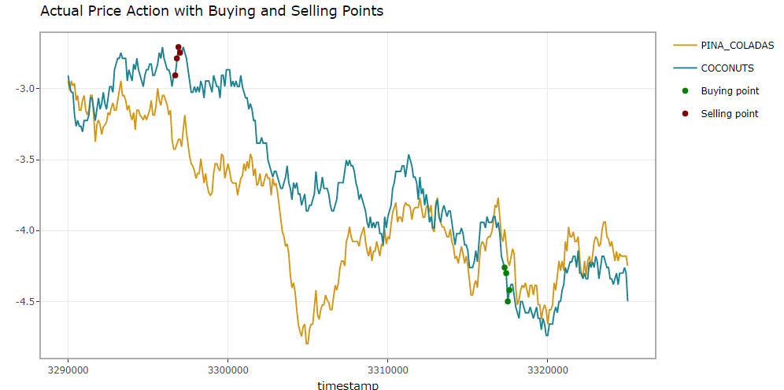

# IMC's Prosperity Trading Challenge

Welcome to the official GitHub repository of team Shiro!

*Highest rank: 45th of 7007 teams*

Prosperity is a 10-day global trading challenge, consisting of 5 rounds, hosted by IMC Trading. For each round, a new product is released with its own characteristics and price action that guide profitable strategies. Teams are challenged to combine Python skills, strategic insight, and analytics to trade on a virtual market and bring their island to prosperity.

We, a team of three penultimate students, managed to reach our final rank of 79th among 7007 global teams. We would love to present our strategies and analysis across this challenging competition.

### Team member:
- Vincent Su (Dat Su)
- Jackie Ho
- Khoa Pham

 

## Round 1

Pearls and Bananas are two products introduced in the first round and we work on them separately.

### *Pearls*

For Pearls, it always stays in a range of [9995, 10000] and has a stable mean of 10000. There are times when the best bid is 10002 or the best ask is 9998. Therefore we market-take any ask below 10000, and accept any bid above 10000.

  
    
     
    Figure 1
  

 

### *Bananas*

For Bananas, the bid and ask price always have a consistent gap and some spikes occur occasionally. We use a method that tracks a simple exponential smoothing (unlike a moving average, the weights attached to the observations decrease exponentially as we go back in time) and cut through the spikes. Whenever it cut a spike, we enter a trade.

Midpoint price is defined by:
$$price_t = \frac{bestask_t + bestbid_t}{2}$$

Simple Exponential Smoothing Equation:
$$l_t = a*mid_t + (1-a)*l_{t-1},$$

 where $a = 0.077$, $l_0 = 4950$ 

The rate at which the weights decrease is controlled by the parameter $a$, which is chosen by running simulated tests to maximise profit. We market-take orders with prices that pass through the SEM line plus an additional range (avoid some spikes that barely pass). This results in a high-frequency trading strategy.

  
    
     
    Figure 2
  

 

## Round 2

New products in this round are Coconuts and Pina Coladas. Unlike round 1, Coconuts and Pina Coladas are pair-traded as they are correlated with each other. Our volatility-based pair-trading strategy begins with standardising their price (midpoint of bid and ask) and their variance.

Standardising equation:
$$z_t=\frac{price_t + \overline{price}}{\sigma} \sim (0,1)$$

__*Opening positions:*__

Next, we compute the 20-step moving average for each product and use it to identify any widened gap larger than 0.3. The moving average helps smooth out volatility-induced fluctuations.

$$| MA20_{coco, t} - MA20_{pina, t} | > 0.3$$

We also calculate the percentage change of the 200-step moving average at time $t$ with time $t-j$ for $j = 20, 40,..., 200$. The $MA200$ has been averaged between Coconuts and Pina Coladas. These percentage changes are then used to determine the number of intervals with increasing and decreasing temporary trends.

$$Pct Change_{t,j} = \frac{MA200_{t} - MA200_{t-j}}{MA200_{t-j}}$$

$$N_{increase} = \sum_{j=20, 40, \ldots, 200} \mathbb{I}({Pct Change}_{t,j} > 0)$$

$$N_{decrease} = \sum_{j=20, 40, \ldots, 200} \mathbb{I}({Pct Change}_{t,j} < 0)$$

  where $\mathbb{I}(x)$ is the indicator function, which returns 1 if the condition $x$ is met, and 0 otherwise.

The temporary trend is identified as bullish when $N_{increase}>6$, and as bearish when $N_{decrease}>6$.

In simple pair trading, whenever the gap is observed, we long the product with a higher price and short the other. However, in this case, we implement a trend indication as an additional condition. Now, we only go long if the temporary trend is upward and go short if the temporary trend is downward.

 

__*Closing positions:*__

After the orders have been matched, we need to continuously observe the gap and close the positions at a suitable condition. Whenever the gap is narrowing until 0.05, we exit the market:

$$| MA20_{coco, t} - MA20_{pina, t} | < 0.05$$

 

  
   
  Figure 3

  
   
  Figure 4

As the gap opens up and the trend is identified as downward, the algorithms short the product with a higher price. This results in some red points marked on the Coconuts series (figure 4). When the gap is closing, the algorithms exit the market, resulting in some green points on the right-hand side. The trade succeeds as we managed to sell high and buy low. 

 

The success of this strategy was remarkable that led to a huge amount of profits for this round. We climbed up 226 ranks and reached the top 45th, which is our highest rank achieved in this competition.

 

## Round 3

The 3rd round introduces another two products, Mayberries and Diving Gears.

### *Mayberries*

Mayberries exhibits a characteristic price movement with a relatively low price at the start of the trading day, reaching a peak in the middle of the day, and then dropping down. This behavior can be illustrated as follows:

  
   
  Figure 5: 3-day Time Series of Mayberries Price 

The time series of Mayberries is decomposed into three components: Trend, Season, and the Remainder ( $T_t + S_t + R_t$ ). The panel's first graph shows the original price movement of Mayberries, and the other ones show the decomposed components respectively. We can see some seasonal changes to the original price across the day, but the volatily makes it a bit harder to identify where the peak and troughs are. That is the reason why decomposition is a good way to separate out seasonal part and others. Moveover, the long-term trend appears unperdictable, which will be ruled out to keep the pure seasonality in the upcoming strategy.

By taking the mean across 3 days of the seasonal component, we make the peak and troughs more obvious:

$$\bar{S_t} = \frac{S_{1,t} + S_{2,t} + S_{3,t}}{3}$$

  where $S_{d,t}$ represents the seasonal component at day $d$ and timestamp $t$

  
   
  Figure 6

The first trough starts at around timestamp 125000. Then the price peaks at timestamp 500000, which is the middle of the day, the drops rapidly until timestamp 750000. Out-of-sample trading day is likely to be different and overfit the given data is not an ideal option. 

Based on pure seasonality, we implement the following trading strategy for Mayberries:

- Buy within timestamp [0, 260000].
- Hold positions until mid-day, start selling and eventually go short for timestamps in [490000, 520000].
- Buy back within timestamp [740000, 1000000].

We end the day with profits.

 

### *Diving Gears*

Diving Gears has an interesting relationship with number of Dolphins across the trading day. Dolphins is not a tradable product. An abrupt change in Dolphins sighted has a causal, positive effect on the price of Diving Gears. 

__*Opening positions:*__

An abrupt change in Dolphins is considered as significant when it is larger than 10. However, since the price of Diving Gears does not reflect the Dolphins changes immediately, we use an interval of 200 to capture this delayed effect.

$$\Delta dolphin_{200} =  dolphin_{t} - dolphin_{t-200} $$

A significant increase is when: $\Delta dolphin_{200} > 10$

A significant decrease is when: $\Delta dolphin_{200} < 10$

Whenever there is a significant increase/decrease, we go long/short accordingly. It can be illustrated in the plot below:

  
   
  Figure 7: Example of a Long Position

 

__*Closing positions:*__

When the price of Diving Gears has taken a move, we need to find a time to close the position. In this case, we exit the market when the short-term trend starts to weaken. The trend is identified similarly as in Round 2, but with shorter moving average: $MA100$.

We calculate the percentage change at time $t$ with time $t-j$ for $j = 10, 20,..., 100$. These percentage changes are then used to determine the number of intervals with increasing and decreasing temporary trends.

$$Pct Change_{t,j} = \frac{MA100_{t} - MA100_{t-j}}{MA100_{t-j}}$$

$$N_{increase} = \sum_{j=10, 20, \ldots, 100} \mathbb{I}({Pct Change}_{t,j} > 0)$$

$$N_{decrease} = \sum_{j=10, 20, \ldots, 100} \mathbb{I}({Pct Change}_{t,j} < 0)$$

  where $\mathbb{I}(x)$ is the indicator function, which returns 1 if the condition $x$ is met, and 0 otherwise.

Assuming we are holding a Long position (the price is increasing), that bullish trend will be considered as weakening if $N_{increase} < 6$. For the Short position, it is vice versa. These closing points ensure we sell back at the highest price, or buy back at the lowest price.

 
 
 

These two strategies did not originate in Round 3. Our original algorithms did not perform well and dragged the Shiro team down from the top 45th. We worked the extra mile to analyse and apply some forecasting practices, striving to come back where we should be.

 

## Round 4

The 4th round introduces a set of related products to trade, including Picnic Basket, Dip, Baguette, and Ukulele. In principle, a Picnic Basket consists of 4 Dip, 2, Baguette, and 1 Ukulele. It is a perfect example of arbitrage trading.

Theoretically, the price of Picnic Basket will not deviate from the sum of its components. Any deviation from the sum will be pushed back to the equilibrium line. 

$$ sum_t = 4dip_t + 2bagt_t + uku_t $$

In which the difference is calculated as:

$$ diff_t = picnic_t - sum_t$$

  
   
  Figure 8: Strong Correlation between Diff and Picnic Basket Price

The price difference follows a mean-reversing, stationary process with $E(diff_t) = 367$. Since the price difference does not stay at 0, we demean the series for simplicity.

$$ \widetilde{diff_t} = diff_t - 367$$

  where $\widetilde{diff_t}$ reoresents the demeaned price difference.

In this strategy, the demeaned price difference will always be pushed back to x-axis when it deviates too much from the latter. We found that a gap of demeaned difference that larger than 100 signal a trading opportunity.

However, $\widetilde{diff_t}$ is not guaranteed to reverse even if it passes above $\pm{100}$. It can reached up to $\pm{300}$ randomly. Therefore, what we aim to do is to send orders when $\widetilde{diff_t}$ is large enough and starts to reverse.

To do this, we implement a similar method of "weakening short-term trend" as in Diving Gears' strategy, but with stricter conditions. Instead of using 6 as a threshold, we use 8 in this case. 

 

The strategy can be summarised as follows.

$$Pct Change_{t,j} = \frac{MA100_{t} - MA100_{t-j}}{MA100_{t-j}}$$

$$N_{increase} = \sum_{j=10, 20, \ldots, 100} \mathbb{I}({Pct Change}_{t,j} > 0)$$

$$N_{decrease} = \sum_{j=10, 20, \ldots, 100} \mathbb{I}({Pct Change}_{t,j} < 0)$$

  where $\mathbb{I}(x)$ is the indicator function, which returns 1 if the condition $x$ is met, and 0 otherwise.

- Send **buy** orders for Picnic Basket, **sell** orders for Dip, Baguette, and Ukulele when:

$$ \widetilde{diff_t} < 100$$

$$N_{decrease} < 8$$

- Send **buy** orders for Dip, Baguette, and Ukulele, **sell** orders for Picnic Basket when:

$$ \widetilde{diff_t} > 100$$

$$N_{increase} < 8$$

 

## Round 5

In the final round, there was no new products introduced. This round is mainly for finetuning and improving your algorithms, using the huge amount of data that we have over the last 4 rounds. 

At this stage, the team was currently at the 150th rank, we doubted that we could achieve our goal of getting into the top 100. Our team finalised all the strategies and algorithms, which are the ones presented above. Surprisingly, the algorithms surpassed our expectations! We had a huge jump to rank 79th! The sheer amount of joy when we were looking at the screen, is unforgettable.

 
 

This challenge, 10 days of grinding, is a great experience with great rewards. We appreciate the time you spent reading till the end, and hope you find your own challenge to conquer.

 
